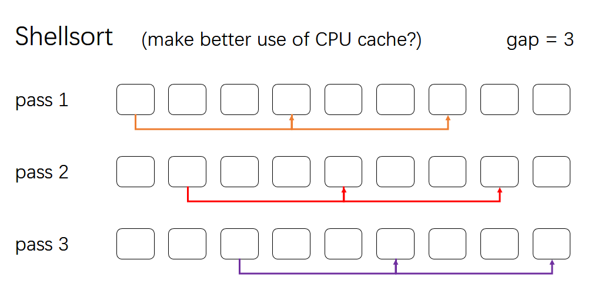

# Sorting

排序算法。

[TOC]

## 1.Elementary Sorting

基于比较的通用排序，适用于任意场景。

### Sorting Methods

Given an array consisting of $n$ elements, sort them.

|      sorting method      | description  | worst case time efficiency | average case time efficiency | space efficiency | stable |
| :----------------------: | :----------: | :------------------------: | :--------------------------: | :--------------: | :----: |
|       Bubble Sort        |   冒泡排序   |          $O(n^2)$          |           $O(n^2)$           |      $O(1)$      |   ✓    |
|      Selection Sort      |   选择排序   |          $O(n^2)$          |           $O(n^2)$           |      $O(1)$      |   ✓    |
|      Insertion Sort      |   插入排序   |          $O(n^2)$          |           $O(n^2)$           |      $O(1)$      |   ✓    |
|  Binary Insertion Sort   | 二分插入排序 |          $O(n^2)$          |         $O(n\log n)$         |      $O(1)$      |   ✓    |
| Comparison Counting Sort | 比较计数排序 |          $O(n^2)$          |           $O(n^2)$           |      $O(n)$      |   ✓    |
|        Shell Sort        |   希尔排序   |        $O(n^{3/2})$        |           unknown            |      $O(1)$      |        |
|        Heap Sort         |    堆排序    |        $O(n\log n)$        |         $O(n\log n)$         |      $O(1)$      |   ✓    |
|        Merge Sort        |   归并排序   |        $O(n\log n)$        |         $O(n\log n)$         |      $O(n)$      |   ✓    |
|        Quick Sort        |   快速排序   |       * $O(n\log n)$       |         $O(n\log n)$         |      $O(1)$      |        |

> 1. 快排有 $1/n!$ 的概率使得worst case开销为 $O(n^2)$
>
> 2. 希尔排序的最差时间效率与所选间隔序列密切相关，当**希尔排序**使用 `3x+1` 的数列为间隔序列（1, 4, 13, 40, ...）时，最差时间开销为 $O(n^{3/2})$，see [wikipedia / Shellsort](https://en.wikipedia.org/wiki/Shellsort) 
>
> 3. 更具体的算法开销分析：https://algs4.cs.princeton.edu/cheatsheet/

### Java Implementations

|                          java class                          |                 description                  |
| :----------------------------------------------------------: | :------------------------------------------: |
| [BubbleSort.java](../src/main/java/com/green/learning_algs4/sort/BubbleSort.java) |                 bubble sort                  |
| [SelectionSort.java](../src/main/java/com/green/learning_algs4/sort/SelectionSort.java) |                selection sort                |
| [InsertionSort.java](../src/main/java/com/green/learning_algs4/sort/InsertionSort.java) |                insertion sort                |
| [InsertionSortOpt.java](../src/main/java/com/green/learning_algs4/sort/InsertionSortOpt.java) |           optimized insertion sort           |
| [BinaryInsertionSort.java](../src/main/java/com/green/learning_algs4/sort/BinaryInsertionSort.java) |            binary insertion sort             |
| [ComparisonCountingSort.java](../src/main/java/com/green/learning_algs4/sort/ComparisonCountingSort.java) |           comparison counting sort           |
| [ShellSort.java](../src/main/java/com/green/learning_algs4/sort/ShellSort.java) | shell sort (gap sequence: 1, 4, 13, 40, ...) |
| [ShellSortX.java](../src/main/java/com/green/learning_algs4/sort/ShellSortX.java) |  shell sort (gap sequence: 1, 2, 4, 8, ...)  |
| [HeapSort.java](../src/main/java/com/green/learning_algs4/sort/HeapSort.java) |             heap sort (inplace)              |
| [HeapSortX.java](../src/main/java/com/green/learning_algs4/sort/HeapSortX.java) |       heap sort (using priority queue)       |
| [MergeSort.java](../src/main/java/com/green/learning_algs4/sort/MergeSort.java) |             standard merge sort              |
| [MergeSortX.java](../src/main/java/com/green/learning_algs4/sort/MergeSortX.java) |    merge sort (array creations overhead)     |
| [MergeSortOpt.java](../src/main/java/com/green/learning_algs4/sort/MergeSortOpt.java) |             optimized merge sort             |
| [MergeSortBU.java](../src/main/java/com/green/learning_algs4/sort/MergeSortBU.java) |     bottom up merge sort (non-recursive)     |
| [QuickSort.java](../src/main/java/com/green/learning_algs4/sort/QuickSort.java) |             standard quick sort              |
| [QuickSortOpt.java](../src/main/java/com/green/learning_algs4/sort/QuickSortOpt.java) |             optimized quick sort             |
| [QuickSort3Way.java](../src/main/java/com/green/learning_algs4/sort/QuickSort.java) |               3 way quick sort               |
| [QuickSort3WayOpt.java](../src/main/java/com/green/learning_algs4/sort/QuickSort.java) |          optimized 3 way quick sort          |

### A.Insertion Sort

插入排序的效率在3种$O(n^2)$基础排序算法（冒泡、选择、插入）中是最高的，交换次数最多为 $\frac{n(n-1)}{2}$ 。当数组中元素趋于有序时，使用插排可以非常高效地将倒置的元素排好序。所以<b>插入排序经常被用来优化其它排序算法。</b>**当外层排序算法（归并排序、快速排序等）递归至规模较小的数组（长度小于阈值cutoff）时，改用插排。**

```java
public class MergeSortOpt
{
    private static final int INSERTION_CUTOFF = 7;
    
    @SuppressWarnings("unchecked")
    public static <E extends Comparable<E>> void sort(E[] A)
    {
        E[] aux = (E[]) new Comparable[A.length];
        System.arraycopy(A, 0, aux, 0, A.length);
        sort(A, aux, 0, A.length - 1);
    }
    
    private static <E extends Comparable<E>> void sort(E[] A, E[] aux, int low, int high)
    {
        // tip1：小数组采用插排
        if (high - low + 1 <= INSERTION_CUTOFF)
        {
            InsertionSort.sort(A, low, high);
            return;
        }
     	
        // perform merge sort
        // ......
    }        
}
```

二分插入排序（Binary Insertion Sort）：由于在每趟排序中，插入排序会把当前待排序元素插入到数组前面已经排好序的列表中，所以可以考虑用二分法快速查找待排序元素的插入位置。平均时间效率为$O(n\log n)$，优于标准插排。

### B.ShellSort

希尔排序利用了插排在处理部分排序（partial sorted）好的数组时性能较优的特点，取得了优于$O(n^2)$的性能。

#### CPU Cache Hit Rate

第一种写法较简洁，只用了3层循环，但似乎CPU缓存命中率不高，效率稍慢一些（维基百科提供的伪代码和algs4.jar包中都是采用这种方式）。解释：交替在多个子数列中走动，局部引用性不好，CPU缓存命中率低？


```java
public static <E extends Comparable<E>> void shellSort1(E[] A)
{
    int N = A.length;

    int h = 1;
    while (h < N / 3)
        h = h * 3 + 1;
    // gap sequence: 1, 4, 13, 40, ...
    while (h >= 1)
    {
        // h-sort the array
        for (int i = h; i < N; i++)
        {
            int j = i;
            E val = A[i];
            for (; j >= h && val.compareTo(A[j - h]) < 0; j -= h)
                A[j] = A[j - h];
            A[j] = val;
        }
        h /= 3;
    }
}
```

第二种写法使用了4层循环，加多了一层外循环，用迭代器k控制子数组间排序的方式，更直观地（Intutively）近于希尔排序的思想：



```java
/**
 * make better use of CPU cache
 * seem to perform better than {@code shellSort1}
 */
public static <E extends Comparable<E>> void shellSort2(E[] A)
{
    int N = A.length;

    int h = 1;
    while (h < N / 3)
        h = h * 3 + 1;

    while (h >= 1)
    {
        // h-sort the array
        // at pass k, sort the k-th subarray
        // make better use of CPU cache
        for (int k = 0; k < h; k++)
            for (int i = k + h; i < N; i += h)
            {
                int j = i;
                E val = A[i];
                for (; j >= h && val.compareTo(A[j - h]) < 0; j -= h)
                    A[j] = A[j - h];
                A[j] = val;
            }
        h /= 3;
    }
}
```

### C.Heap Sort

作为一种$O(n\log n)$的算法，堆排序不是很出众。不过，比起归并排序，堆排序是inplace的，空间效率为$O(1)$；比起快排，堆排序能保证最差时间开销为$O(n\log n)$，而快排则有极低的概率（非常非常低的 $1/n!$）使得worst case开销为$O(n^2)$。

堆排序用到的主要操作是sink，步骤分解为：

1. 构建最大堆 $O(N)$ （算法分析，最差时间开销为 $O(N)$ ）
2. 每次迭代sink最大元素 $O(N\log N)$

```java
public class HeapSort
{
    public static <E extends Comparable<E>> void sort(E[] A)
    {
        // 1.Construct a maximum heap with 0-based index
        for (int i = A.length / 2 - 1; i >= 0; i--)
            sink(A, A.length, i);
        
        // 2.In loop {@code i}, constantly exchange
        // * the current root with the last {@code i} element,
        // * and then sink the new root.
        // * Repeat {@code N - 1} loop
        for (int i = A.length - 1; i > 0; i--)
        {
            ArrayUtils.swap(A, i, 0);
            sink(A, i, 0);
        }
    }
    
    /**
     * sink the element at index {@code k} of a maximum heap {@code A} with length
     * {@code N}
     *
     * @param A   the maximum heap
     * @param N   the length of the maximum heap
     * @param k   the index of the element to be sank
     * @param <E> the type of the elements
     */
    private static <E extends Comparable<E>> void sink(E[] A, int N, int k)
    {
        E element = A[k];
        int j = 2 * k + 1;
        while (j < N)
        {
            if (j < N - 1 && A[j + 1].compareTo(A[j]) > 0)
                j++;
            if (element.compareTo(A[j]) >= 0) break;
            A[k] = A[j];
            k = j;
            j = 2 * k + 1;
        }
        A[k] = element;
    }
}
```

### D.Merge Sort


### E.Quick Sort


### F.Partitioning


## 2.Radix Sorting


### Sorting Methods

|       sorting method       |  description  | worst case time efficiency | average case time efficiency | space efficiency | stable |
| :------------------------: | :-----------: | :------------------------: | :--------------------------: | :--------------: | :----: |
| Distribution Counting Sort | 分布计数排序  |          $O(n^2)$          |           $O(n^2)$           |      $O(1)$      |   ✓    |
| Key Indexed Counting Sort  |   计数排序    |          $O(n^2)$          |           $O(n^2)$           |      $O(1)$      |   ✓    |
|       LSD Radix Sort       |               |          $O(n^2)$          |           $O(n^2)$           |      $O(1)$      |   ✓    |
|       MSD Radix Sort       |               |          $O(n^2)$          |         $O(n\log n)$         |      $O(1)$      |   ✓    |
|        Inplace MSD         |               |          $O(n^2)$          |           $O(n^2)$           |      $O(n)$      |   ✓    |
|  Quick Sort 3 Way String   | 3路字符串快排 |        $O(n^{3/2})$        |         $O(n\log n)$         |      $O(1)$      |        |
|     Suffix Array Sort      | 后缀数组排序  |        $O(n\log n)$        |         $O(n\log n)$         |      $O(1)$      |   ✓    |

### Java Implementations

|                          java class                          |              elements              |              description              |
| :----------------------------------------------------------: | :-----------------------------------: | ------------------------------------- |
| [DistributionCountingSort.java](../src/main/java/com/green/learning_algs4/sort/DistributionCountingSort.java) | integer | distribution counting sort |
| [KeyIndexedCountingSort.java](../src/main/java/com/green/learning_algs4/sort/KeyIndexedCountingSort.java) | character | key index counting sort |
| [.java](../src/main/java/com/green/learning_algs4/sort/.java) |                             |                             |
| [.java](../src/main/java/com/green/learning_algs4/sort/.java) |                             |                             |
| [.java](../src/main/java/com/green/learning_algs4/sort/.java) |                             |                             |
| [.java](../src/main/java/com/green/learning_algs4/sort/.java) |                             |                             |
| [.java](../src/main/java/com/green/learning_algs4/sort/.java) |                             |                             |
| [.java](../src/main/java/com/green/learning_algs4/sort/.java) |                             |                             |


## 3.Index Sorting

index sort `edu.princeton.cs.algs4.Insertion`

返回一个索引数组，代表该下标的元素在排序后的数组中的索引。


★Suffix Array Sorting将该方法用得很精妙。


