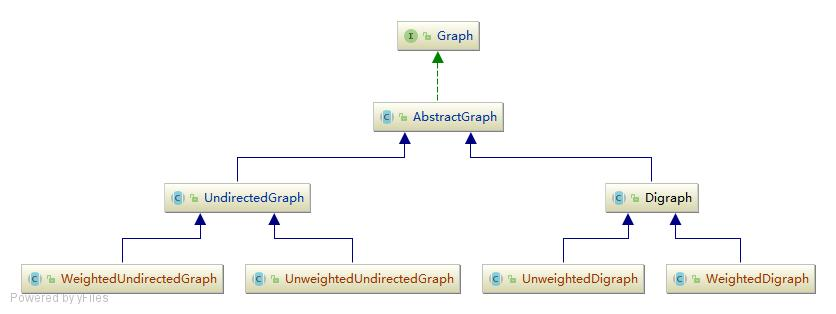
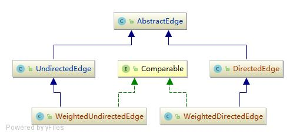

# Graph

## API Design

## Graph Hierachy

按边的方向划分
- UndirectedGraph 无向图
- Digraph(DirectedGraph) 有向图

按边是否带权重划分
- UnweightedGraph 不带权重的图
- WeightedGraph 加权图

考虑到**边的方向**是图的第一特性，而[**边是否带权重**]则处于相对次要位置。
所以就给出了以下设计：



### Edge Hierarchy



## Code

### 1.Graph API

```lua
├── Graph -- 图接口
|   ├── AbstractGraph -- 抽象图
|       ├── UndirectedGraph -- 抽象无向图
|       |   ├── UnweightedUndirectedGraph -- 抽象无向无权图
|       |   └── WeightedUndirectedGraph -- 抽象无向加权图
|       |
|       └── Digraph -- 抽象有向图
|           ├── UnweightedDigraph -- 抽象有向无权图
|           └── WeightedDigraph -- 抽象有向加权图
|    
├── AbstractEdge -- 抽象边
|   ├── UndirectedEdge -- 无向边
|   |   └── WeightedUndirectedEdge -- 无向加权边
|   |
|   └── DirectedEdge -- 有向边
|       └── WeightedDirectedEdge -- 有向加权边
|
├── Path -- 路径
├── SymbolGraph -- 符号图
├── GraphUtils -- 图工具类
```

### 2.Graph Routine API

```lua
GraphProcessRoutine -- 图处理例程接口
├── SearchPaths -- 遍历图
|   ├── DFSPaths -- 深度优先遍历
|   ├── DFSPathsNonRec -- 深度优先遍历非递归实现
|   ├── BFSPaths -- 广度优先遍历
|   └── MultiSourcesBFSPaths -- 多源广度优先遍历
|
├── DFSOrder -- DFS遍历中节点的入栈、出栈顺序
├── ConnectedComponents -- 连通分量
|   ├── CCBFS
|   └── CCDFS
|
├── StrongConnectedComponents -- 强连通分量
|   ├── KosarajuSharirSCC
|   ├── 
|   └──
| 
├── BipartiteGraphSolver -- 二分图（染色法）
|   ├── BipartitieGraphSolverDFS 
|   └── BipartitieGraphSolverBFS
|
├── CircuitFinder -- 查找回路
|   ├── UndirectedGraphCircuitFinder 
|   └── DigraphCircuitFinder 
|   └── DigraphCircuitFinderX 非递归 
|
├── TopologicalSort -- 拓扑排序
|   ├── TopologicalSortDFS 
|   └── TopologicalSortX
|
├── EulerianCycle -- 欧拉回路
├── MinimumSpanningTree -- 最小生成树
|   ├── KruskalMST 
|   ├── LazyPrimeMST
|   └── EagerPrimeMST

```


