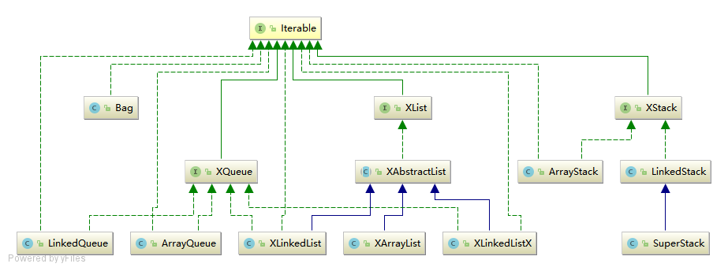

# list
This package contains several implementations of list-based data structures such as **list, stack && queue**.
The design puts emphasis on providing specific APIs of the corresponding data structure 
rather than creating a perfect collection framework in a whole like *Java Collection Framework* ：）提供了线性表、队列和栈的实现，设计关注提供特定的API，而不是构建一个像Java集合框架那样“完美”的框架。

## 1.Hierarchy

```lua
├── XList -- 线性表接口
|   └── XAbstractList -- 抽象线性表
|       ├── XArrayList
|       ├── XLinkedList
|       └── XLinkedListX -- 带空头节点的链表
|       
├── XStack -- 栈接口
|   ├── XArrayStack
|   └── XLinkedStack
|       └── XSuperStack -- 支持delete操作
|
├── XQueue -- 队列接口
|   ├── XArrayQueue
|   └── XLinkedQueue
|
└── XBag -- Multi-Set 不支持删除操作、下标索引，只允许添加和迭代元素的简单结构
```



## 2.Ideas of Design 

设计追求简单，符合特定数据结构的特性。像 `XBag` 数据结构，实际上是没有 `delete` 操作的 `Stack` 或 `queue` ，尽管实现近乎相同，但还是重新实现了 `XBag` 。客户端在使用 `XBag` 时是没有办法移除其中的元素的，这样就保证了相对的安全性（safety）。

<b style="color:red">Warning</b>

* 这些数据结构不是线程安全的。
* 迭代器设计过于简单
  * 不支持 `remove` 操作
  * 生成迭代器后，如果原有数据结构发生改变，那么会引起迭代器内元素和原有数据结构不一致的风险

**重要设计思想**

* Resizing Array 动态扩容和收缩，**摊销效率（Amortized Efficiency）**为 `O(N)`
* LinkedList 链式结构，**平均效率（Average Case）**为 `O(N)`，比较稳定，适用于对性能要求特别苛刻的场景（流式处理）

### 2.1.Resizing Array
数组空间管理
* 扩容：当空间存满时，数组长度扩大为2倍
* 收缩：当空间存储利用率小于25%时，数组长度缩小为1 / 2

线性表会维持 25% ~ 100% 的存储利用率。用 `minLoadFactor` 表示线性表允许的最小空间利用率，当空间利用率小于该阈值时，线性表会自动收缩。但是由于线性表多出来的空间就是浪费，为了让设计简单，没有必要让用户（client）设置 `minLoadFactor` ，取固定值为 25% 即可。

如果用户需要节省空间，那么：

* 可设置 `autoShink` 为 `true` ，这样线性表会自动收缩
* 或者手动调用 `trimToSize()` ，立即压缩线性表的多余空间

```java
public class XArrayStack<E>
{
    private static final int DEFAULT_CAPACITY = 16;
    private static final int MAXIMUM_CAPACITY = Integer.MAX_VALUE;
    private int size;
    private E[] elements;
    
    /**
     * When autoShrink is enabled, the list will auto shrink to
     * half of the current capacity if 75% of its space is empty.
     * default: autoShrink = false
     */
    private boolean autoShrink;
    
    public XArrayStackk()
    {
        this(DEFAULT_CAPACITY);
    }
    
    @SuppressWarnings("unchecked")
    public XArrayStackck(int capacity)
    {
        if (capacity <= 0) 
        	throw new IllegalArgumentException("capacity >= 0");
        if (capacity > MAXIMUM_CAPACITY) 
        	throw new IllegalArgumentException(
        		"maximum capacity is " + MAXIMUM_CAPACITY);
        elements = (E[]) new Object[capacity];
    }
    
    public boolean isAutoShrink()
    {
        return autoShrink;
    }
    
    public void setAutoShrink(boolean autoShrink)
    {
        this.autoShrink = autoShrink;
    }
    
    // a helper function
    private void resize(int capacity)
    {
        assert capacity >= size;
        elements = Arrays.copyOf(elements, capacity);
    }
    
    // expand the array to enlarge capacity
    private void ensureCapacity()
    {
        if (size == elements.length)
        {
            if (size == MAXIMUM_CAPACITY) 
            	throw new OutOfMemoryError(
            		"No more element can be pushed into the stack.");
            if (elements.length < MAXIMUM_CAPACITY)
            {
                int newSize = size >= (MAXIMUM_CAPACITY >> 1) ? 
                	MAXIMUM_CAPACITY : 2 * size;
                resize(newSize);
            }
        }
    }
    
    // shrink the array to save capacity
    private void saveCapacity()
    {
        if (autoShrink 
                && elements.length > DEFAULT_CAPACITY 
                && 4 * size < elements.length)
        {
            int newCapacity = elements.length / 2;
            if (newCapacity < DEFAULT_CAPACITY)
                newCapacity = DEFAULT_CAPACITY;
            resize(newCapacity);
        }
    }
    
    /**
     * 压缩空间到恰好容纳所有元素
     * 客户端主动要求压缩空间
     */
    public void trimToSize()
    {
        if (size > 0 && size < elements.length)
        {
            int newCapacity = size < DEFAULT_CAPACITY ? 
            	DEFAULT_CAPACITY : size;
            resize(newCapacity);
        }
    }
    
    @Override
    public void push(E element)
    {
        ensureCapacity();
        
        // store the item 
        // ...
    }
    
    @Override
    public E pop()
    {
        // remove the item 
        // ...
        
        saveCapacity();
        // return the element
    }
    
    @SuppressWarnings("unchecked")
    @Override
    public void clear()
    {
        size = 0;
        if(autoShrink)
            elements = (E[]) new Object[DEFAULT_CAPACITY];
        else Arrays.fill(elements, null);
    }
}
```

### 2.2.LinkedList
链式结构，参考 [list.XLinkedList](<../src/main/java/com/green/learning_algs4/list/XLinkedList.java>) 的实现
* 操作链式结构
  * 遍历链表
  * 插入节点
  * 删除节点
  * ……
* 维护链式结构的一致性

| size | head | tail |
| :--- | :--- | :--- |
| 0 | `null` | `null` |
| 1 | `x` | `x` |
| `N (N > 1)` | `x` | `y`  (`x != y`) |

#### 2.2.1.带空头节点的链表 

为了简化代码的逻辑，可以让链表的头节点 `head` 不带有数据（即 `head.item = null`）。具体代码见 <a href="../src/main/java/com/green/learning_algs4/list/XLinkedListX.java">list.XLinkedListX</a>

## 3.Further Study

阅读源码

* `java.util.ArrayList`
* `java.util.LinkedList`