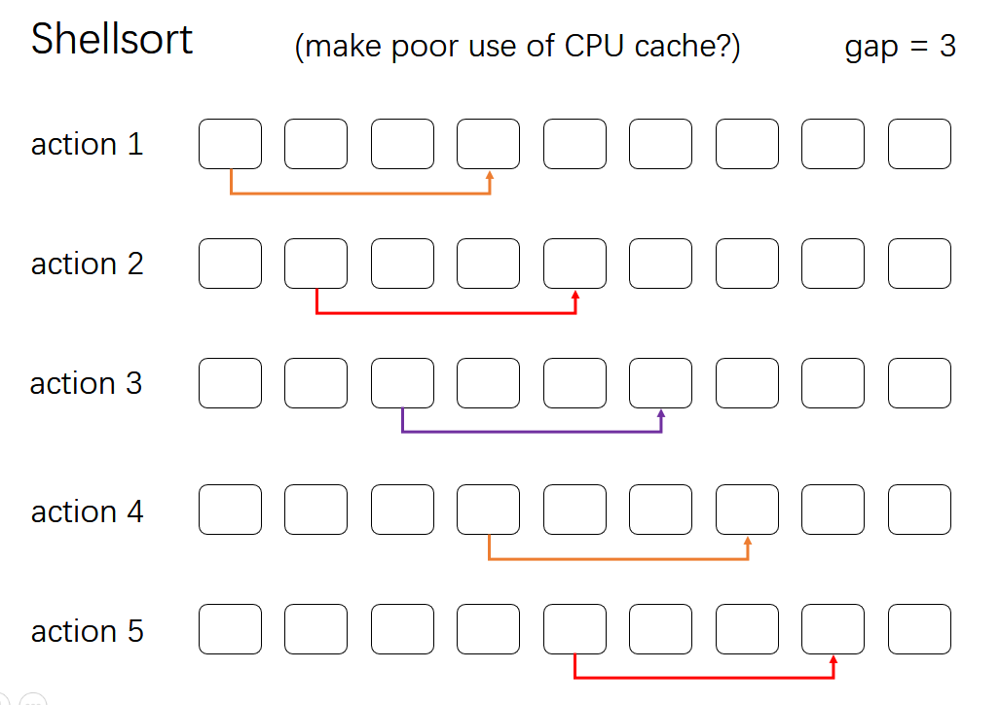
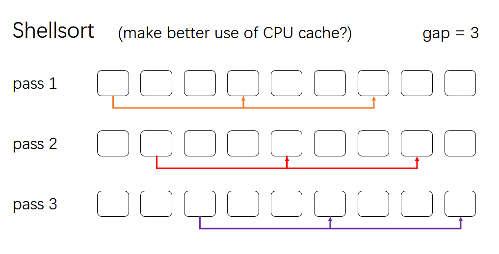

# Sorting


## 1.Elementary Sorting

基于比较的通用排序，适用于任意场景。

|       java class       | description  | worst case time efficiency | space efficiency | stable |
| :--------------------: | :----------: | :------------------------: | :--------------: | :----: |
|       BubbleSort       |   冒泡排序   |          $O(n^2)$          |      $O(1)$      |   ✓    |
|     SelectionSort      |   选择排序   |          $O(n^2)$          |      $O(1)$      |   ✓    |
|     InsertionSort      |   插入排序   |          $O(n^2)$          |      $O(1)$      |   ✓    |
| ComparisonCountingSort | 比较计数排序 |          $O(n^2)$          |      $O(n)$      |   ✓    |
|       ShellSort        |   希尔排序   |        $O(n^{3/2})$        |      $O(1)$      |        |
|        HeapSort        |    堆排序    |        $O(n\log n)$        |      $O(1)$      |   ✓    |
|       MergeSort        |   归并排序   |        $O(n\log n)$        |      $O(n)$      |   ✓    |
|       QuickSort        |   快速排序   |        $O(n\log n)$        |      $O(1)$      |        |

### 1.1.ShellSort

> see [wikipedia / Shellsort](https://en.wikipedia.org/wiki/Shellsort) 

希尔排序的最差时间效率与所选间隔序列密切相关，当**希尔排序**使用 `3x+1` 的数列为间隔序列（1, 4, 13, 40, ...）时，最差时间开销为 $O(n^{3/2})$ 

#### CPU缓存命中率影响

第一种写法更接直观地（Intutively）近于希尔排序的思想：



```java
/**
 * make better use of CPU cache
 * seem to perform better than {@code shellSort2}
 */
public static <E extends Comparable<E>> void shellSort1(E[] A)
{
    int N = A.length;

    int h = 1;
    while (h < N / 3)
        h = h * 3 + 1;

    while (h >= 1)
    {
        // h-sort the array
        // at pass k, sort the k-th subarray
        // make better use of CPU cache
        for (int k = 0; k < h; k++)
            for (int i = k + h; i < N; i += h)
            {
                int j = i;
                E val = A[i];
                for (; j >= h && val.compareTo(A[j - h]) < 0; j -= h)
                    A[j] = A[j - h];
                A[j] = val;
            }
        h /= 3;
    }
}
```

以下写法更加简洁，但似乎CPU缓存命中率不高，效率稍慢一些：



```java
public static <E extends Comparable<E>> void shellSort2(E[] A)
{
    int N = A.length;

    int h = 1;
    while (h < N / 3)
        h = h * 3 + 1;
    // gap sequence: 1, 4, 13, 40, ...
    while (h >= 1)
    {
        // h-sort the array
        for (int i = h; i < N; i++)
        {
            int j = i;
            E val = A[i];
            for (; j >= h && val.compareTo(A[j - h]) < 0; j -= h)
                A[j] = A[j - h];
            A[j] = val;
        }
        h /= 3;
    }
}
```

## 2.Integer & String Sorting


## 3.Index Sorting

index sort `edu.princeton.cs.algs4.Insertion`

返回一个索引数组，代表该下标的元素在排序后的数组中的索引。